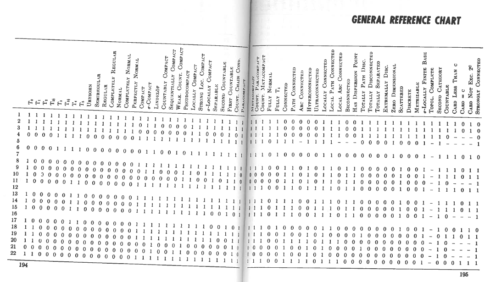

# Statement of need

> Topology is a dense forest of counterexamples. A usable map of the forest is a fine thing.

The preceding quote is paraphrased from Mary Ellen Rudin's review
[@mer:1971] of Counterexamples in Topology [@MR1382863]. This text
became well-known as a convenient handbook of the topological properites
and counter-examples that would have been considered standard to
researchers in general topology active in its date
of publication (1970).

In general topology, researchers focus on the structure of **topological
spaces**. A space is a pair $\langle X,\mathcal T\rangle$ such that
$X$ is a set of points, and $\mathcal T$ is a set of subsets of $X$,
known as the **open sets** which serve as "neighborhoods" of each
point they contain. In this way, topological spaces generalize
Euclidean spaces $\mathbb R^n$ (e.g. 
[S25](https://topology.pi-base.org/spaces/S000025) and 
[S176 of π-Base](https://topology.pi-base.org/spaces/S000176)), 
where each vector
$\vec x\in\mathbb R^n$ has open neighborhoods of the form
$B_\epsilon(\vec x)=\{\vec y:d(\vec x,\vec y)< \epsilon\}$. Then
a **property** of a topological space is some characteristic defined
in terms of its open sets; for example, a space is compact
([P16 of π-Base](https://topology.pi-base.org/properties/P000016))
provided every collection of open sets whose union contains the space
contains a finite subcollection whose union contains the space.

*Counterexamples in Topology* was developed as an outcome of
National Science Foundation REUs (research experiences for undergraduates)
held in Summers 1967 and 1968. The authors and their students worked
diligently to survey the field and provide a comprehensive crosslisting
of over 140 topological spaces and 60 topological properties, summarized
in the General Reference Chart depicted in \autoref{fig:book-chart}.

Today, the book remains a well-referenced resource by many looking
for a standard reference for these properties. However, its second
and final edition was released in 1978, meaning that recent advances
in the field are not represented in the text. Furthermore, several
errata remain even in this second edition, an unsurprising outcome from 
manually authoring a textbook and database tracking over 7200
space/property pairs.

# Summary

In 2014, James Dabbs created the first iteration of what is now
known as the *π-Base community database of topological counterexamples*
hosted at <https://topology.pi-base.org>. Inspired by Steen and Seebach's
*Counterexamples*, the goals of π-Base were as follows:

1. Provide an interactive version of *Counterexamples* available on
the open web.
2. Track not only spaces and properties, but also
[theorems](https://topology.pi-base.org/theorems) that
allow for the automated deduction of a space's properties from
a small number of assertions.
3. Extend the content of *Counterexamples* by supporting a 
community-maintained living database that can
serve both researchers and students in perpetuity.
4. Disambiguate topological concepts that go by different
or conflicting terminology in the literature by assigning
spaces and properties unique IDs.

Iterations of the π-Base have taken various forms, including
a modified wiki and later a custom Ruby on Rails application.
In its early years, it was mostly used as a reference on
Math.StackExchange, and did not have any form of formal peer review
on its contributions, leading to several errata and undersupported
claims to be included in the database.

In 2017, Steven Clontz joined the project to serve as its
lead mathematical editor, and later a co-maintainer of its
software infrastructure. Dabbs and Clontz were both graduate
students at the same institution in the early 2010s,
and while Dabbs established a career in software
engineering, Clontz entered academia as a topology researcher.
Clontz officially joined the project in part to investigate
the establishment of π-Base as a "scholarly product" that would
be respected and of use by active researchers in general topology,
in the vein of other [mathematical databases](https://mathbases.org/)
such as the LMFDB [@lmfdb].

To accomplish this, the π-Base was refactored into the form it exists
in today. The frontend of the application is a single-page application
written in SvelteKit. This application ingests a single JSON file that
contains peer-reviewed data on topological spaces, properties, and
theorems that have been established in the literature or other moderated
sources such as MathOverflow or Math.StackExchange. This payload is
quite small, with the JSON built as of 2024 March taking up less than
one megabyte of space. The π-Base takes this data and then processes
it in the client in order to deduce any missing space/property pairs.
For example, if a theorem states that all "compact" and "Hausdorff" spaces
are "normal", then any space that's marked as both compact and Hausdorff
will also be deduced to be normal. Furthermore, any space marked as
compact and not normal is automatically deduced to be not Hausdorff,
and so on.

The decision to refactor π-Base into a client-side application was
motivated by the desire for sustainability:
there are no shortage of free web hosts for static HTML/JS applications,
which due to their simplicity tend to have very reliable uptime, in
contrast to hosting solutions for server-side applications. It also
addresses a security concern: the only way to compromise the application
is to gain access to its deployment workflows, not via the application
itself.

However, as a client-side application, there is no way to contribute to the
π-Base through its website. Instead, its contribution workflow is
offloaded to GitHub's infrastructure using the `pi-base/data`
repository [@pibasedata]. Three directories (`properties`, `spaces`,
and `theorems`) contain Markdown files with YAML frontmatter. Each
space then has its own `properties` subdirectory containing Markdown/YAML
files that describe each asserted space/property pair. Each file
includes the object's ID, name, and a brief definition and/or justification
as appropriate, with citations to the literature and/or public forums
that ensure contributions to the π-Base are held to appropriate scrutiny.

Using this workflow, all
contributions can be reviewed by community members via GitHub pull 
requests. GitHub Actions automatically compile each push to the
repository into the aforementioned JSON file, and then deliver it
to an AWS S3 instance to be ingested by the π-Base frontend application.
While only the payload of the `main` branch is used as the "official"
database and made available by default on the hosted
<https://topology.pi-base.org> application, visitors (and in particular,
pull request reviewers) may visit the
[Advanced page](https://topology.pi-base.org/dev) to select any other
branch of `pi-base/data` to preview any proposed contribution.

Using GitHub pull requests brings with it both benefits and compromises.
GitHub is not a tool used by most mathematicians on a regular basis, so there
is a need for training for new contributors and reviewers. This also means
that there's no way to customize the contribution and review process; while
the π-Base wiki documents the "happy path" for users to contribute and review using
the browser-based `GitHub.dev` service, there are many features of `GitHub.dev`
that are not typically relevant to the mathematician contributor/reviewer
that serve only as a distraction to a Git novice.
On the other hand, a strong advantage is that there is no overhead for
maintaining custom software to manage contributions and reviews, and as noted
earlier, this displaces the security concerns associated with access management
away from the π-Base team and into the hands of GitHub. And for that subset of
mathematician users who are already familiar with GitHub, they do arrive
to the community with an existing knowledge of how to contribute.

While frequently used as a resource to aid scholars
in searching the literature, π-Base is infrequently cited as a primary
source. As such, the impact of the π-Base is perhaps best measured by its 
frequent citation as an authoritive source on the
Math.StackExchange [@pibasemathse] and MathOverflow [@pibasemo] forums.

Additionally, recent enhancements to the web inferface now enable the
discovery of open (to π-Base) questions. As a result, π-Base
is now a convenient resource for the
development of problems for student researchers, giving these novice
mathematicians an opportunity to "contribute" to research infrastrcture by
way of π-Base, even when results on their own would not be considered "new"
or "publishable" in the traditional literature.

<!-- # Citations

Citations to entries in paper.bib should be in
[rMarkdown](http://rmarkdown.rstudio.com/authoring_bibliographies_and_citations.html)
format.

If you want to cite a software repository URL (e.g. something on GitHub without a preferred
citation) then you can do it with the example BibTeX entry below for @fidgit.

For a quick reference, the following citation commands can be used:
- `@author:2001`  ->  "Author et al. (2001)"
- `[@author:2001]` -> "(Author et al., 2001)"
- `[@author1:2001; @author2:2001]` -> "(Author1 et al., 2001; Author2 et al., 2002)"

# Figures

Figures can be included like this:

and referenced from text using \autoref{fig:example}.

Figure sizes can be customized by adding an optional second parameter:
{ width=20% } -->

# Acknowledgements

The π-Base would not be of value to mathematics researchers without its
volunteer community of contributors and reviewers. Particular thanks
are due to Chris Caruvana, Patrick Rabau, and Lynne Yengulalp for their
support of the project in recent years. Additional thanks are due to
Austin Mohr and Scott Varagona for their prior contributions to early
iterations of the project.

Funding for the π-Base was provided by an internal University of South
Alabama faculty development grant.

The π-Base is dedicated to the memory of our friend and mentor
Gary Gruenhage.

# References